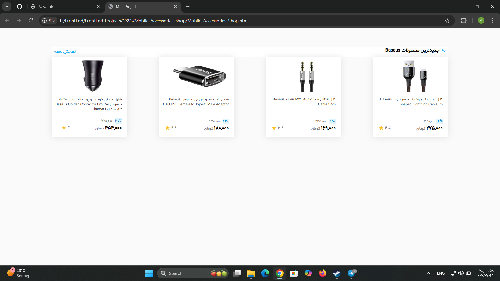

# 🛒 Mobile Accessories Shop

A simple and responsive store page designed to display four mobile accessories products.  
Each product card includes an image, name, price, discount, and rating stars.  
This project is built using HTML5 and CSS3.

---

## 🔹 Features
- Display of 4 products with details (name, image, price, discount, rating)  
- Responsive design for both mobile and desktop  
- Product cards with hover effects  
- Modern colors and clean layout using Flexbox  
- Lightweight and beginner-friendly code  

---

## 🛠️ Technologies Used
- HTML5  
- CSS3 (Flexbox, Grid, Hover Effects)

---

## 📁 Folder Structure
Mobile_Accessories_Shop/ │ ├── Mobile-Accessories-Shop.html ├── Mobile-Accessories-Shop.css ├──  icon.svg  |——  32_ExplainPractice-1/ │   ├──  fonts/  |   |——   Shabnam-FD.woff2  |——  images  |   |—— img1.jpg │   ├── img2.jpg │   ├── img3.jpg │   └── img4.jpg └── README.md
---

## 👀 Preview

---

## 👨‍💻 About This Project
This project was created as a part of my frontend learning journey.  
It helped me practice responsive design, product layout, and styling with CSS.

---

⭐ If you like this project, please give it a star on GitHub!

---

# 🛒 فروشگاه لوازم جانبی موبایل

یک صفحه‌ی فروشگاهی ساده و واکنش‌گرا برای نمایش چهار محصول لوازم جانبی موبایل.  
هر کارت محصول شامل تصویر، نام، قیمت، تخفیف و امتیاز با ستاره است.  
این پروژه با استفاده از HTML5 و CSS3 ساخته شده است.

---

## 🔹 ویژگی‌ها
- نمایش ۴ محصول با جزئیات کامل (نام، تصویر، قیمت، تخفیف، امتیاز)  
- طراحی واکنش‌گرا برای موبایل و دسکتاپ  
- افکت هاور برای کارت‌های محصول  
- رنگ‌بندی مدرن و ساختار منظم با Flexbox  
- کد ساده و مناسب برای تمرین فرانت‌اند  

---

## 🛠️ تکنولوژی‌های استفاده‌شده
- HTML5  
- CSS3 (Flexbox, Grid, Hover Effects)

---

## 👨‍💻 درباره‌ی پروژه
این پروژه بخشی از مسیر یادگیری من در زمینه‌ی فرانت‌اند است.  
در این تمرین با طراحی واکنش‌گرا، چیدمان محصولات و استایل‌دهی با CSS تمرین کرده‌ام.

---

⭐ اگر از این پروژه خوشتان آمد، خوشحال می‌شوم در GitHub به آن ستاره (Star) بدهید!
